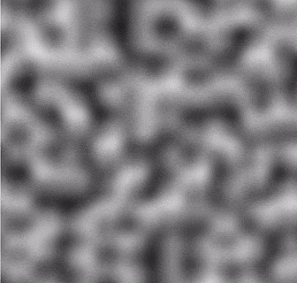

# Perlin Noise Generator

This JavaFX application generates dynamic Perlin noise images using the provided `PerlinNoise` class.



## Features

- Generates Perlin noise images in real-time
- Automatically updates the noise image, creating a dynamic visual effect
- Displays the generated Perlin noise image in a JavaFX window

## Requirements

- Java JDK 11 or later
- JavaFX 11 or later
- Maven

## Installation

1. Clone this repository:

```bash
git clone https://github.com/dnfesenk/PerlinNoiseGenerator.git
```

2. Change to the project directory:

```bash
cd PerlinNoiseGenerator
```

## Running the Application

Execute the JavaFX application:

```bash
mvn clean javafx:run
```

## Usage

When you run the application, a window displaying the dynamically generated Perlin noise image will appear. The application will continuously update the Perlin noise image, creating a dynamic visual effect.

## License

This project is licensed under the MIT License. See the [LICENSE](LICENSE) file for details.
